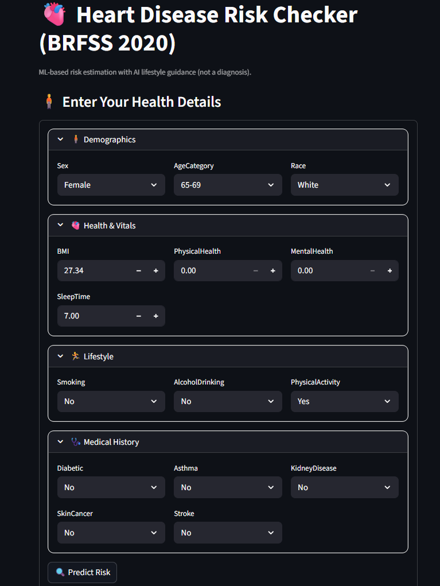
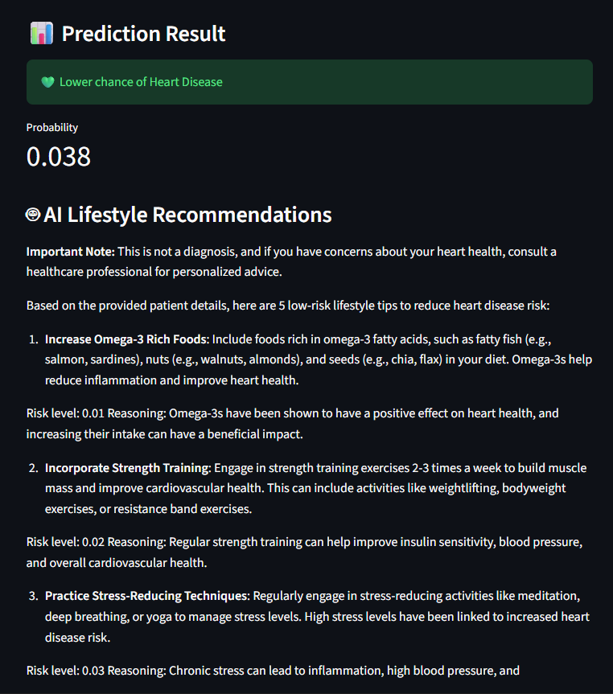

# 🫀 Heart Disease Risk Checker

A Streamlit-based machine learning application that predicts the likelihood of heart disease using the **CDC BRFSS 2020 dataset** and provides **AI-powered lifestyle recommendations** using a Large Language Model (Groq).

This project is built for **educational and awareness purposes only** and demonstrates the integration of **Machine Learning + Explainable AI + LLMs** in a real-world healthcare use case.

---

## 🚀 Key Features

- Heart disease risk prediction using **Random Forest**
- Probability-based risk estimation
- **SHAP explainability** to show feature contributions
- **AI-generated lifestyle recommendations** using Groq LLM
- Compact, modular, and user-friendly UI
- Fully reproducible local setup

---

## 🧍 Health Parameters Input Interface

The image below shows the user interface where individuals enter their **demographic, lifestyle, and medical parameters** such as age, BMI, sleep duration, smoking habits, and existing health conditions.

<!-- IMAGE 1: INPUT INTERFACE -->
<p align="center">
  
</p>

---

## 📊 Prediction Result & AI Suggestions

After submitting the health details, the application displays:
- Heart disease risk prediction (Yes / No)
- Probability score
- Feature contribution visualization (SHAP)
- AI-generated lifestyle improvement suggestions

<!-- IMAGE 2: RESULT + AI SUGGESTIONS -->
<p align="center">
  
</p>

---

## 🛠️ Technology Stack

- **Frontend:** Streamlit  
- **Machine Learning:** Scikit-learn (Random Forest)  
- **Explainability:** SHAP  
- **AI Recommendations:** Groq LLM  
- **Programming Language:** Python  

---

## ⚙️ How to Run Locally

### 1️⃣ Clone the Repository
```bash
git clone https://github.com/<your-username>/heart-disease-risk-checker.git
cd heart-disease-risk-checker
